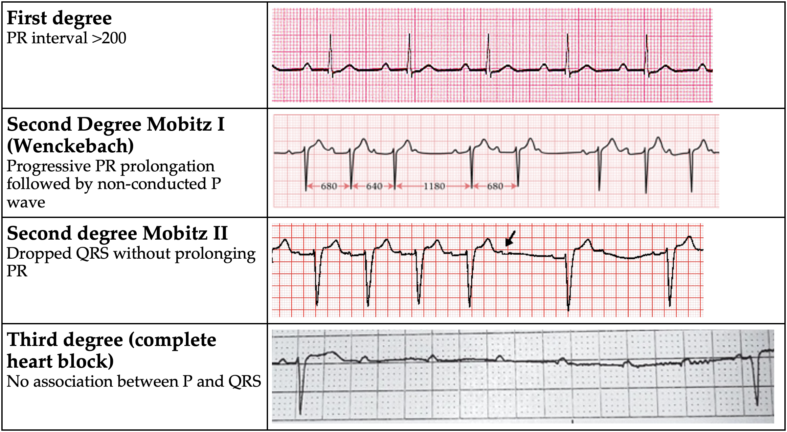
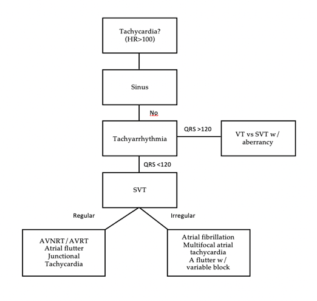
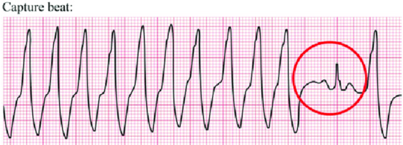
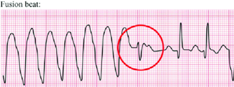

# Arrhythmias

---

## Acute management 
- 12-lead EKG if possible and have defib pads on patient
- Is the pt unstable (hypotensive, signs/symptoms of
    hypoperfusion)?
- Is the information real?
    - Review tele strips if stable: VUMC Web Resources -\> VUH PIICiX
    Philips Web -\> patient selection -\> alarm review
    (vuhphilipsweb.app.vumc.org)
    - Review past EKGs to determine if patient has had this rhythm before
- Ensure pt has good IV access
- Labs: BMP, Mg, TSH, and +/- troponin, tox screen

## Bradyarrhythmias - Lin Cao 

### Background

- Broadly classified as sinus node dysfunction (pacing defect) or
    atrioventricular block (conduction defect)
- Clinical presentation varies widely based on underlying cause,
    timing, degree of block/dysfunction
    - Unlikely to cause symptoms if HR \>50
    - Symptoms include syncope/presyncope, dyspnea, angina

### Potential Etiologies

- Infection (including perivalvular abscess from endocarditis)/sepsis
- Ischemia
- Rheumatologic/Inflammatory
- Post-cardiac surgery
- Hypothyroidism
- Sleep apnea
- Infiltration (amyloid, hemochromatosis)
- High vagal tone (pain, nausea)
- Medications: Antihypertensives, antiarrhythmics, psychoactive meds,
    anesthetics, cannabis, muscle relaxants, etc.

AV Block

### Evaluation

- TTE if structural disease suspected
- Ambulatory cardiac monitoring if frequently symptomatic

### Management

- Avoid nodal blocking agents – Adenosine, Beta-blockers, CCBs,
    Digoxin
- Observation if asymptomatic
- Treat identified underlying causes
- If symptomatic or high-grade block (Mobitz II or complete heart
    block), EP consult for pacemaker evaluation
- If unstable:
- Atropine (0.5 mg every 3 to 5 minutes; maximum total dose: 3 mg)
    - Do NOT use in heart transplant
    - Call CCU Fellow
    - Dopamine (5 to 20 mcg/kg/minute) OR Epi (2 to 10 mcg/min)
    - Transvenous pacing
      (Pacer pads on the defib device are capable of pacing,
      but don’t forget to sedate!)

## Tachyarrhythmias - Narrow complex

Manasa Atyam 

---

### Background

- Three causes of tachyarrhythmias
    - Re-entry: patient with structural heart disease (ex post-infarction
    scar)
    - Abnormal Automaticity: electrolyte abnormalities or acute ischemia
    (Purkinje fibers)
    - Triggered Activity: early and late after depolarizations. Ex:
    Hypokalemia, ischemia, infracts, excess calcium and drug toxicity

### Evaluation

- Unstable tachyarrhythmia
- Start with treatment, determine type later
- Synchronized cardioversion: place defibrillator pads, consider
    0.5-2mg IV midazolam for sedation, prepare for synchronized
    cardioversion at 200J (can ↑ to 300-360 J)

Tachyarrhythmia differential

### Management

- Sinus tachycardia- Almost always secondary
    - Address underlying causes: fever/sepsis, hypo/hypervolemia, anxiety,
      anemia, PE, ACS, hypoxia, pain, urinary retention, withdrawal
- Atrial Fibrillation/Flutter – See Atrial fibrillation section
- AVNRT/Orthodromic AVRT
    - Look for p buried in QRS, rate 150-250, AVRT will have delta waves
    when NSR
    - Vagal maneuvers (1st line): Sit patient upright have them blow into
    tip of 10cc syringe for 10-15 seconds rapidly lay supine and raise
    legs
    - Adenosine (2nd line): therapeutic (break AVRT/AVNRT) and diagnostic
    (allows visualization of underlying rhythm)
        - Do NOT give in heart transplant, severe COPD, pre-excitation
        causing wide complex tachycardia (WPW antidromic AVRT)
        - Peripheral line at AC or above w/ arm elevated:
          6mg x1, 6mg x1 (if not effective after 1-2 min),
          12mg x1 (if refractory to 6mg)
        - Central line: cut dose in half to 3mg x1, 3mg x1, 6mg x1
- Multifocal atrial tachycardia
    - 3 or more p wave morphologies. Seen in cardiac and pulmonary disease
    - Usually does not cause hemodynamic instability
    - BBs and non-DHP CCBs can be effective, need to address underlying
      issue

<table>
<colgroup>
<col style="width: 18%" />
<col style="width: 24%" />
<col style="width: 31%" />
<col style="width: 25%" />
</colgroup>
<thead>
<tr class="header">
<th>Drug</th>
<th>Dosing</th>
<th>Benefits</th>
<th>Side Effects</th>
</tr>
</thead>
<tbody>
<tr class="odd">
<td>Metoprolol</td>
<td>
5mg IV q5m x3

PO metoprolol tartrate 12.5mg q6 hours ↑ every 6 hr to
target
</td>
<td>
Good 1st line agent

Less BP effect than dilt
</td>
<td>
Hypotension,

Negative inotropy
</td>
</tr>
<tr class="even">
<td>Diltiazem</td>
<td>
10-20 mg IV over 2m q15m x2

drip = 5-15 mg/hr
</td>
<td>Good 1st line w/ normal EF with drip needed</td>
<td>
Hypotension

Avoid in HFrEF
</td>
</tr>
<tr class="odd">
<td>Esmolol</td>
<td>
500 mcg/kg bolus

drip = 50-200 mcg/kg/min
</td>
<td>
Rapid onset/offset

RBC metabolism
</td>
<td>Hypotension</td>
</tr>
<tr class="even">
<td>Amiodarone</td>
<td>150 IV over 10-30m, then 1 mg/m for 6h, then 0.5mg/m for 18h</td>
<td>
Minimal BP effects

Long lasting; Relatively fast onset (acute effect is mostly beta
blockade)
</td>
<td>
Pulmonary and thyroid toxicity

Cardioversion
</td>
</tr>
<tr class="odd">
<td>Digoxin</td>
<td>500mcg IV x1, then 250mcg IV q6h x2-3</td>
<td>Great for reduced EF, positive inotropy</td>
<td>
Slow onset

Depends on vagal tone – poor in hyper- adrenergic states
</td>
</tr>
<tr class="even">
<td>Procainamide</td>
<td>20-50 mg/min loading, 1-4 mg/min maintenance</td>
<td>Use in pre-excitation syndromes (i.e. WPW), does not inhibit AV nodal
conduction</td>
<td>
Lupus-like syndrome

Hypotension
</td>
</tr>
</tbody>
</table>

## Tachyarrhythmias - Wide Complex and PVCs 

Manasa Atyam 

---

### Definitions

Ventricular tachycardia (VT): a run of 3+ PVCs

- Sustained VT: VT for 30 seconds or shorter if it requires
    intervention
- Nonsustained VT (NSVT): VT for \< 30 seconds
- VT storm: 3+ separate episodes of sustained VT within 24 hrs.

VT Morphologies

- Monomorphic VT: similar QRS configuration from beat to beat
    - Usually 2/2 scar-mediated VT from prior infarction
- Polymorphic VT: a continuously changing QRS configuration from beat
    to beat
    - Ischemia until proven otherwise
- Torsades de Pointes (TdP): a form of polymorphic VT with a continually
    varying QRS that appears to spiral around the baseline of the ECG in
    a sinusoidal pattern
- Ventricular fibrillation (VF): chaotic rhythm characterized by
    undulations that are irregular in timing and morphology, without
    discrete QRS complexes

Ventricular Tachycardia vs. SVT with aberrancy

- VT: The action potential originated in the ventricles (ex: VT)
- Supraventricular tachycardia with aberrancy: the action potential
    originates from a focus above the ventricles & conducts through the
    AV node with a delay or block resulting in a wide QRS (mimics VT)
- Ex: sinus tachycardia w/ bundle branch block (block may be rate
    dependent), AF w/ LBBB

Many ways to differentiate VT vs. SVT w/ aberrancy

- Consult cardiology for assistance
- Look for ECG features suggestive of VT
- Very broad complexes \>160 ms
- RsR’ complex with a taller left rabbit ear In V1/2
- AV dissociation (P/QRS dissociation)
- Capture Beats: native QRS complexes making a cameo during the VT
- Fusion Beats: QRS which appears like a signal average of VT and
        native complex

- There are more advanced criteria to help distinguish. The aVR
    (Vereckie) criteria is one example that is fast and accurate

### Management

Unstable

- Sedate with midazolam 1-2mg
- Cardioversion for monomorphic VT. Synchronized shock at 100-200J
- Defibrillation if VF/polyVT

Stable

- Medications (as below)

<table>
<colgroup>
<col style="width: 24%" />
<col style="width: 25%" />
<col style="width: 25%" />
<col style="width: 24%" />
</colgroup>
<thead>
<tr class="header">
<th>Drug Name</th>
<th>Dosing</th>
<th>Mechanism</th>
<th>Side Effects</th>
</tr>
</thead>
<tbody>
<tr class="odd">
<td>Amiodarone</td>
<td>150mg IV over 10 min, then 1mg/min for 6 hours; repeat bolus if VT
recurs</td>
<td>
Class III

-K+ channel blocker; has class Ia, II, &amp; IV effects
</td>
<td>Bradycardia, hypotension (acutely)</td>
</tr>
<tr class="even">
<td>Lidocaine</td>
<td>1-1.5 mg/kg (usually 75-100 mg) at a rate of 25-50mg/min; lower
doses of .5-.75mg/kg can be repeated every 5-10 min as needed</td>
<td>
Class IB

-fast Na+ channel blocker-&gt; slows conduction
</td>
<td>Slurred speech, AMS, seizures, bradycardia</td>
</tr>
<tr class="odd">
<td>Procainamide</td>
<td>20-50mg/min until arrhythmia terminates or max dose 17mg/kg is
reached</td>
<td>
Class IA

-fast Na+ channel blocker -&gt; slows conduction

-K+ channel blocker-&gt; prolongs repolarization
</td>
<td>
Bradycardia, hypotension, torsades, drug-induced lupus

Avoid in HF pts, prolonged QT
</td>
</tr>
</tbody>
</table>

- Cardioversion If refractory to medical management

- Treatment of underlying cause if identifiable
    - Ischemia, electrolyte disturbances, heart failure, drugs

## Premature Ventricular Complexes (PVCs)

Madeline Rukavina

---

### Background

- Premature Ventricular Complex (PVC): early ventricular
    depolarization +/- mechanical contraction
- PVC burden: % of beats of ventricular origin / total beats over a
    24h period
- PVCs are common: Up to 80% of apparently healthy people have PVCs
- Normal number of PVCs in an adult is \<500 in 24h

### Etiologies

- HTN with LVH, prior MI/scar, HF, myocarditis, ARVC, HCM, idiopathic
    VT, OSA, pHTN, COPD, thyroid disease, substance use (EtOH, nicotine,
    stimulants, caffeine)

### Inpatient Evaluation & Management

- 12 lead EKG: conduction disease, long QT syndrome, Brugada syndrome,
    ARVC
- Labs: K, Mg, TSH, drug screen
- Evaluate for QT prolonging agents (risk of Torsades)
- Evaluate tele for PVC burden
- Inpt consult to EP for PVCs rarely warranted unless significant PVC
    burden (\>5 PVC/min, consistently) in setting of reduced LVEF.
- For pts with \>5 PVC/min or pts with symptoms, discharge with
    Ziopatch (VA) or mobile cardiac telemetry (VU) and obtain TTE if
    none recent.
