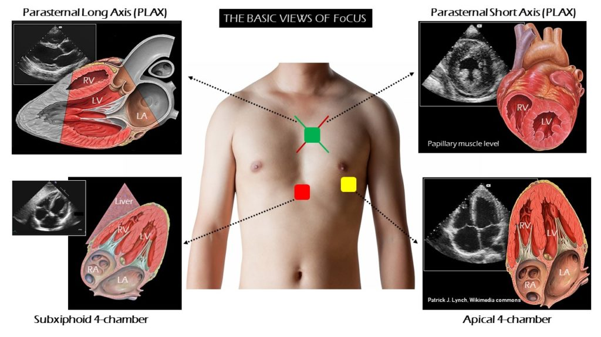
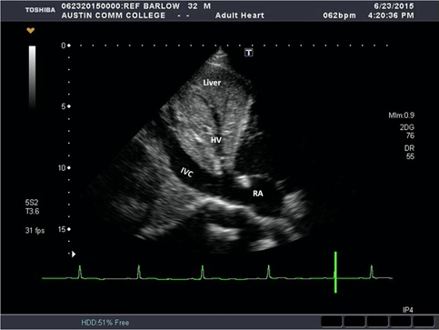

# Bedside Echocardiography

Jamie Pfaff

---

## Finding an Ultrasound

- MICU: radiology room behind charge nurse's desk in middle hallway
- VA ICU: In front of resident workspace
- 8N: Behind nursing station before entering cleaning supply room
- 8S: In supply closet to left as you walk toward nursing station -
    (door code is 1-3-5)
- 6MCE: COVID restricted (ask nurses)
- CCU/5N only: supply room on left as entering CCU
- Round wing: 5th floor, ask nurses

## TTE Standard Views

### Parasternal long

- Probe position: Rotate probe 180 degrees with right edge of
    probe/probe marker pointing toward pt’s left shoulder
- Make sure probe is centered over mitral valve (In right spot if you
    can see MV and AV)
- E Point Septal Separation (EPSS) 
    - Distance separating the anterior MV leaflet from the septal wall
        as measure of LV systolic function (easy evaluation of systolic
        function)
    - Place M mode spike at tip of mitral leaflet and hit M mode
        (perpendicular to septum)
    - Identify E point (passive filling of LV) and determine distance
        from interventricular septum (IVS)
        - <7mm = Normal
        - \>10mm = HF
    - Confounders that elevate EPSS: AR, MS

### Parasternal short

- Probe position: Rotate probe 180 degrees with right edge of
    probe/probe marker pointing toward patient’s left shoulder
- Good position to assess EF by visualizing wall thickening

### Apical four chamber

- Probe position: Slide down and look near patient’s left nipple (or
    in the intermammary fold after lifting up breast tissue if needed -
    at PMI if able to palpate)
- Good to assess EF by visualizing cardiac shortening

### Subxiphoid

- Probe position: Push probe head into pt’s abdomen just below
    xiphoid and flatten probe to make nearly parallel to pt’s
    position, marker to pt’s left
- Troubleshooting: shift probe slightly left of midline (toward
    pt’s right) and angle toward heart/right to use liver as
    acoustic window or ask pt to take big breath (moves heart
    closer to probe)
- Best window to visualize pericardial effusion

### IVC

<figure markdown>

</figure>

- Probe position: subxiphoid area with probe marker facing toward
    pt’s head tilted slightly left of midline, trace IVC into RA to
    verify correct vessel (vs aorta)
- IVC size and collapsibility used as a surrogate for CVP and RAP
    - <2.1 cm and >50% collapse: RAP ~3mmHg
    - <2.1 cm and < 50% collapse or >2.1cm and >50% collapse: RAP ~8mmHg
    - \>2.1cm, <50% collapse: RAP ~ >15mmHg

## Resources

- https://www.coreultrasound.com/basic-cardiac-function/
- http://pie.med.utoronto.ca/tte
- https://www.echocardiographer.org/TTE.html
- App: FATE CARD (Focus Assessed Transthoracic Echocardiography) https://test.usabcd.org/fate-card/
