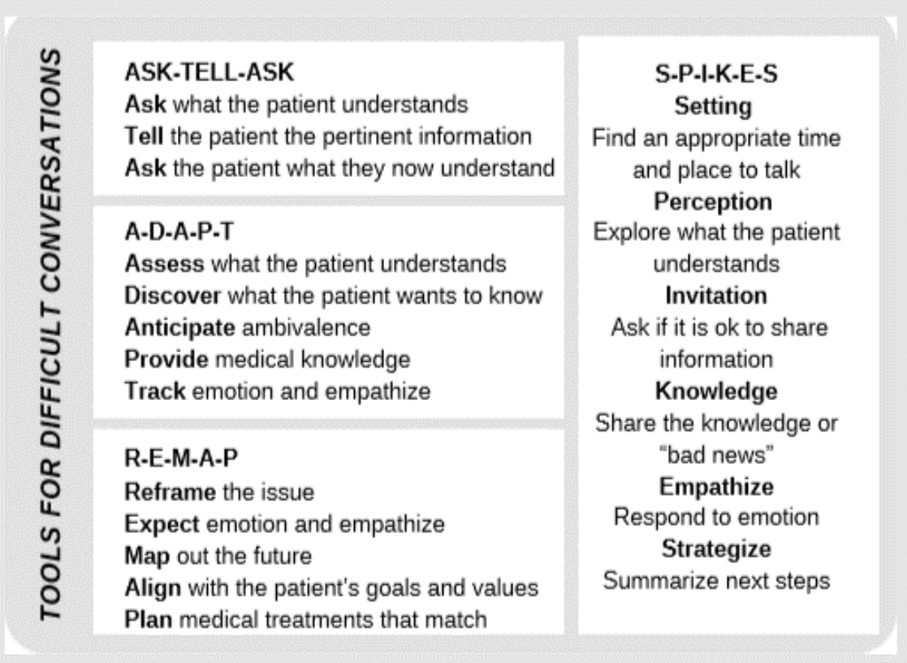

# Video Examples for Navigating Difficult Conversations

Mohana Karlekar

---

Navigating difficult conversations with patients can be daunting
especially if you have never seen someone do one well before. 
Conversations should follow a logical and sequential approach, much like
any procedure we perform in medicine.  Like all procedures, practice
makes us better.

<figure markdown>
{ width="300" }
  <figcaption markdown>
QR code [link](https://sso.service.vumc.org/idp/startSSO.ping?PartnerSpId=https%3A%2F%2Flearningexchange.vumc.org%2FAccount%2FSAML&TargetResource=https%3A%2F%2Flearningexchange.vumc.org%2F%23%2Fonline-courses%2Ff955c1a3-c682-4e43-91d6-1baf9cc1d7f3) for Learning Exchange module “Navigating Difficult Conversations With Patients”
  </figcaption>
</figure>

Good communicators have both **formulated** their message and
**identified** which communication strategy to use before they initiate
a conversation

Here are some suggestions for “Navigating Difficult Conversations”

-   Step 1. Determine your message-keep it simple and short
-   Step 2. Identify what type of news you are communicating: breaking
    bad news, assessing understanding of information, communicating
    prognosis or navigating goals of care
-   Step 3. Pick the video that best suits your purpose

<figure markdown>
  
</figure>
