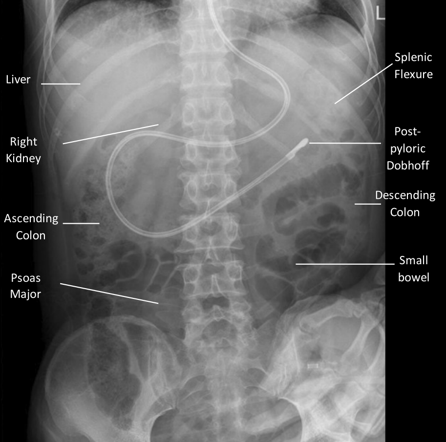

# Basic Abdominal X-ray Interpretation

Gautam Babu

---

As with chest radiographs, use a systematic approach. Here are some
important reminders:

- Patient positioning (marked by tech):
- Supine films poorly evaluate for free air, but are fine for
    evaluating bowel gas pattern, tube positioning
- Upright or left lateral decubitus are more sensitive for free air
- NGT films
    - Film will not include the lower abdomen so cannot fully evaluate
        bowel gas pattern. If you don't see your NGT, confirm that the tube
        is not coiled in the oropharynx, esophagus or airway (check CXR if
        necessary).
    - Post pyloric placement should be to the right of the midline with
        the tube resembling the “C-loop” of the duodenum.
- Bowel caliber – small bowel distension more than 3cm caliber may be
    abnormal, is there distal gas? Recent operative intervention?
    Differential: ileus vs SBO
- Colon – identify by haustration. Cecum and rectum can be distended
    up to 9cm. Remainder of colon should be under 6cm. Stool burden?
    Twist/volvulus?
- Gas (where it shouldn't be) – look for lucency against straight
    lines (diaphragm, liver, falciform).
    - Large volume air can also outline bowel wall against intraluminal
        air
    - Bowel wall shouldn't have gas (pneumatosis)
    - Liver gas can be pneumobilia (prior ERCP/stent) or portal venous gas
        (from ischemic bowel)
- Bladder – foley projecting in right location?
- Soft tissues – may faintly see kidney margins, psoas. No big/obvious
    soft tissue mass?
- Bones – rib fractures, spine compression deformities, pelvic/hip
    fractures

<figure markdown>

<figcaption markdown>KUB example</figcaption>
</figure>
